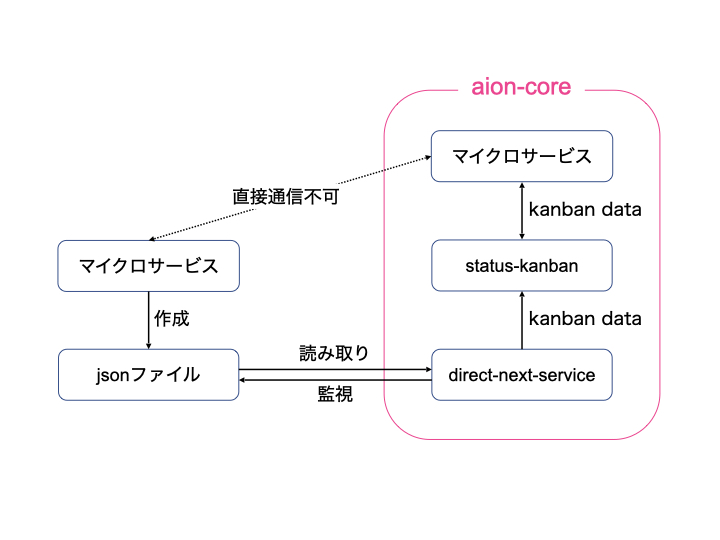

# direct-next-service
direct-next-serviceは、aion-core内外で立ち上げられたマイクロサービス間の通信を仲介するマイクロサービスです。

# 概要
aion-core内で立ち上げられるマイクロサービスと、aion-core外で立ち上げられるマイクロサービスは直接通信することができません。
しかし、aion-core内で立ち上げられたdirect-next-serviceを使って通信の仲介をすることで、aion-core内外のマイクロサービス同士の通信が可能になります。

# システム構成図
direct-next-serviceは、jsonファイルの新規作成を監視し、作成された場合にファイル内の情報を読み取ります。
その後、その情報をstatus-kanbanに渡すことで、aion-core内外で立ち上げられたマイクロサービス間の通信が可能になります。   
status-kanbanとは、AIONの通信プロトコルおよびそのプロトコルでやりとりされるデータのことです。


# 動作環境
direct-next-serviceは、aion-coreのプラットフォーム上での動作を前提としています。
使用する際は、事前に下記の通りAIONの動作環境を用意してください。   
- ARM CPU搭載のデバイス(NVIDIA Jetson シリーズ等)   
- OS: Linux OS     
- CPU: ARM/AMD/Intel     
- Kubernetes     
- AION のリソース   

# 事前準備
direct-next-serviceのDockerのbase imageとしてpython-base-image（AIONのマイクロサービスで利用するpythonライブラリ及びpython版のベースイメージ）を想定しています。
そのため、base imageを確認、またはpython-base-imageをbuildする必要があります。   
※python-base-imageのGithub URL: https://github.com/latonaio/python-base-images   

# セットアップ
```
git clone git@github.com:latonaio/direct-next-service-kube.git
cd direct-next-service-kube
make docker-build
```

# 起動方法
kubernatesにdeployされることにより起動されます。   
aion-core上で動作するマイクロサービスとして想定されているため、project.yamlにマニフェストを記載し、aion-core経由でデプロイしてください。

# Input/Output
## input
aion-core側で指定したパス監視し、その中でjsonファイルが新たに作成されたら、そのjsonファイル内の文字列を辞書に変換することで、情報を読み込みます。

## output
通信先がローカルの場合：   
- connection_key     
- output_data_path：aion-core外のマイクロサービスでoutputに使用されるパス  
- metadata   
- file_list：ファイルリスト（ファイルリストがない場合、何も返されない）        
   
通信先がリモートの場合：   
- connection_key   
- output_data_path   
- metadata：aion-core外のマイクロサービスのメタ情報  
- device_name：端末名  
- file_list   
- process_number = 1   
  
 